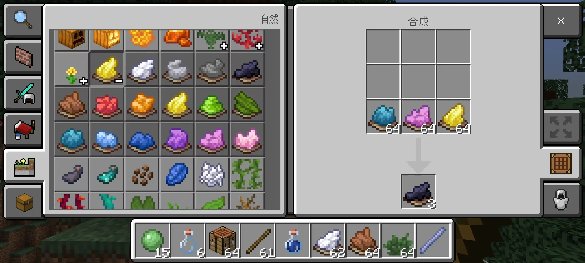

# Dye Tricks 

[English](README.md) | 简体中文

📖 完整配方表：[recipes_zh.md](recipes_zh.md)

一个用于 **Minecraft 基岩版** 的行为包，可以使用染料转换原材料。

在 Minecraft 里制作红石装置时，虽然蜂蜜块能替代粘液块，但制作粘性活塞依然离不开史莱姆球，这实在太麻烦了！于是我就想：要是能把蜂蜜染成史莱姆球的颜色，直接代替它使用会怎么样？

**《染料技艺》** 这个模组里就藏着几十种这样巧妙的想法！安装后，你不用再为了材料和怪物战斗，只需养花、挖矿、耕种，就能获取大部分生物掉落类原材料，而且所有合成配方都是可再生的！

## 功能特点

- 🎨 染料转化体系  
  使用染料为核心媒介，将常见材料转化为对应颜色与质感的资源，配方直观且易于理解。

- ⚔️ 无需打怪获取掉落物  
  许多原本来自生物的材料现在可以通过种植、采集与加工获得，适合和平或自动化玩法。

- 🏛️ 无需探索特定结构  
  部分原本依赖遗迹或特殊地点的物品现在可通过染料配方制作，减少跑图需求。

- 🐾 无需狩猎动物  
  动物掉落物可由植物或自然材料替代获得，支持可持续与农场化生产。

- ♻️ 资源全面可再生  
  多种有限或不可再生方块可通过转化重新获得，使世界资源循环化。

- 🧪 创意与装饰拓展  
  提供染料驱动的趣味配方与装饰物转化，增强创造模式与建筑玩法的自由度。

## 安装方法 
1. 前往 Releases 页面下载最新版本。
2. 导入行为包到 Minecraft 基岩版。
3. 在世界设置中启用该行为包。

## 开源许可 
MIT License 

## 贡献代码 
欢迎提交 Pull Request！